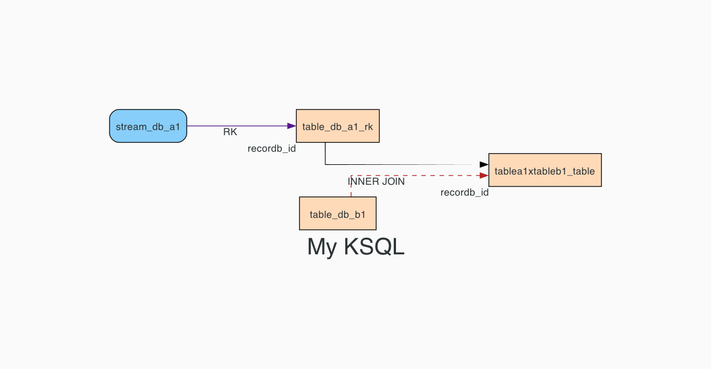

## KSQL Diagram Generator

This script aims to create a diagram of a KSQL code.

## Instalation
### Pre-requisites:

The following must be installed:
- Python (this was created using Python 3.8)
- Pip
- Graphviz

## How to use:

The script takes as input a KSQL script file, a diagram title and the output file name.
```
Usage: python ksql_diagram.py [input-ksql-file] [diagram-title] [output-name]
```

## Usage example:


```bash
# Create a python environment:
virtualenv -p /opt/homebrew/bin/python3.8 env3.8

# Activate the environment:
source env3.8/bin/activate

# Install the dependencies:
pip install -r requirements.txt

# Run the script:
python ksql_diagram.py ksql-example.sql "My KSQL" my-diagram
```

## Diagram example
The above command will generate the following diagram:


